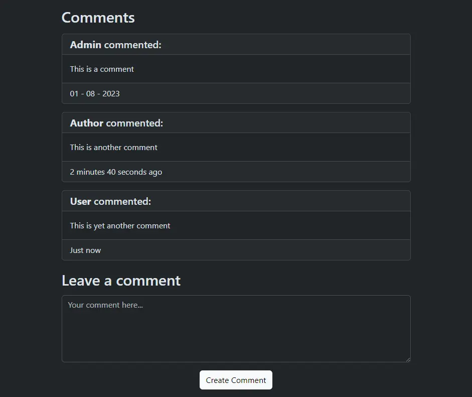

# News Site

Web app for a news site or other similar articles built with Ruby on Rails.

## Description

News web app with a fully functioning user authentication system set up using Devise. There are 3 roles available: **User**, who can only view and comment articles, **Author**, who can also publish articles, and **Admin** who can do all of the above in addition to editing and deleting articles.

The app also features a mailing system for user registration confirmation and password recovery and a series of tests for checking that the user roles have the correct permissions.

## Views

### Index


### Article view (with admin panel)


### Comments example


### Log in


### Edit user


Placeholder images from [placekitten](https://placekitten.com/) 🐱

## Deploy on Heroku via CLI

* Log in using ```heroku login```
* Create app using ```heroku create```
* Connect to app using ```heroku git:remote -a app_name```
* Upload app using ```git push heroku main```
* Run migrations using ```heroku run rails db:migrate```
* Configure environment variables for mailer in Heroku's app settings:
    * Email host url in ```email_url``` (this should be the app's url)
    * Email username in ```email_username```
    * Email password in ```email_password```
    * Email address in ```email_address```
    * Email host in ```email_host```
    * Email port in ```email_port```

## Software used

* [Ruby 3.2.2](https://www.ruby-lang.org/en/)  
* [Rails 7.0.6](https://rubyonrails.org/)  
* [PostgreSQL 14.8](https://www.postgresql.org)  
* [Bootstrap 5.3.1](https://getbootstrap.com/)  

### Gems

* [Annotate 3.2.0](https://github.com/ctran/annotate_models)  
* [Devise 4.9.2](https://github.com/heartcombo/devise)  
* [Figaro 1.2.0](https://github.com/laserlemon/figaro)

## Possible improvements

* Article search with [PgSearch](https://github.com/Casecommons/pg_search)  
* Pagination with [Pagy](https://github.com/ddnexus/pagy)
